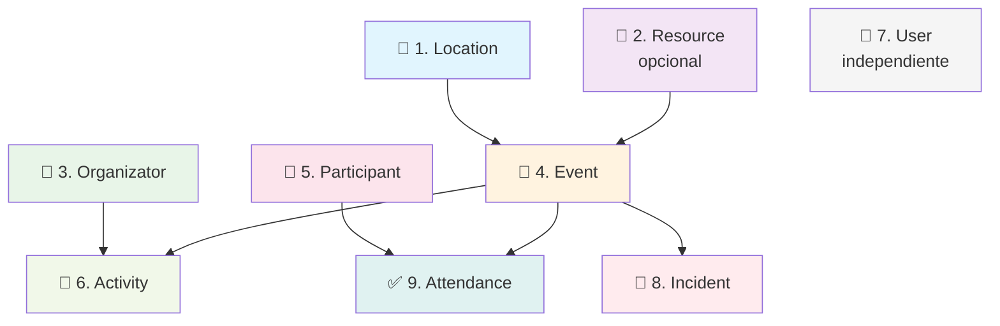
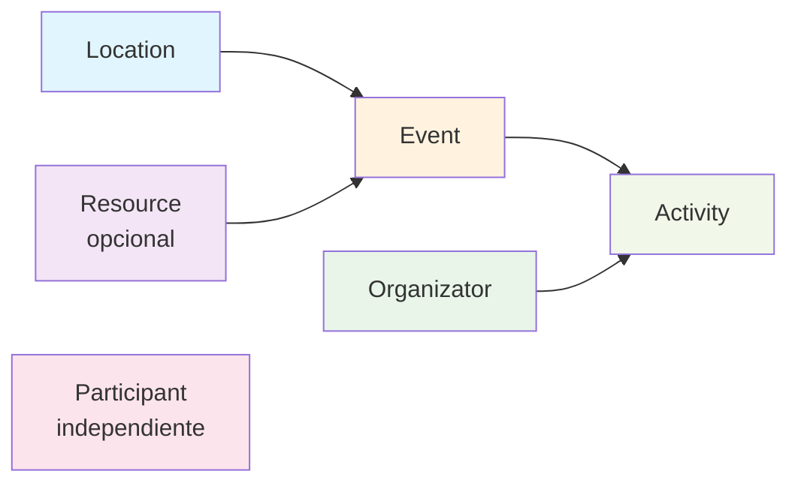

# 🎯 EventLogistics - Sistema de Gestión Logística para Eventos

[](https://dotnet.microsoft.com/download/dotnet/8.0)
[](https://blog.cleancoder.com/uncle-bob/2012/08/13/the-clean-architecture.html)
[](https://es.wikipedia.org/wiki/Desarrollo_ágil_de_software)
[](https://www.sqlite.org/)
[](https://swagger.io/)

> **Sistema integral para la gestión logística de eventos**, desarrollado con **Clean Architecture** y **metodología Ágil basada en Casos de Uso (Ágil-UC)** para garantizar escalabilidad, mantenibilidad y entrega de valor continuo.

## 📋 Tabla de Contenidos

- [🎯 Descripción del Proyecto](#-descripción-del-proyecto)
- [🏗️ Arquitectura del Sistema](#️-arquitectura-del-sistema)
- [📊 Metodología de Desarrollo](#-metodología-de-desarrollo)
- [✨ Funcionalidades Principales](#-funcionalidades-principales)
- [🚀 Instalación y Configuración](#-instalación-y-configuración)
- [📝 Documentación de API](#-documentación-de-api)
- [🧪 Pruebas y Ejemplos](#-pruebas-y-ejemplos)
- [🎭 Casos de Uso Implementados](#-casos-de-uso-implementados)

## 🎯 Descripción del Proyecto

**EventLogistics** es una plataforma robusta diseñada para gestionar de manera integral todos los aspectos logísticos de eventos, desde la planificación hasta la ejecución. El sistema permite administrar recursos, ubicaciones, participantes, actividades y generar reportes detallados en tiempo real.

### 🎪 Casos de Uso Principales
- **Gestión de Eventos**: Creación, programación y seguimiento de eventos
- **Administración de Recursos**: Control de inventario y asignación inteligente
- **Gestión de Participantes**: Registro y control de asistencia
- **Reportes y Análisis**: Métricas de uso y optimización de recursos
- **Sistema de Incidencias**: Manejo de problemas durante eventos

## 🏗️ Arquitectura del Sistema

### 🔧 Clean Architecture Implementation

El proyecto implementa **Clean Architecture** con estricta separación de responsabilidades:

```
EventLogistics/
├── 🎮 EventLogistics.Api/           # Presentation Layer
│   ├── Controllers/                 # REST API Controllers
│   ├── Middleware/                  # Cross-cutting concerns
│   └── Program.cs                   # Application entry point
│
├── 🧩 EventLogistics.Application/   # Application Layer
│   ├── DTOs/                       # Data Transfer Objects
│   ├── Interfaces/                 # Service contracts
│   ├── Services/                   # Business logic implementation
│   └── Mappers/                    # Entity-DTO mapping
│
├── 🏛️ EventLogistics.Domain/        # Domain Layer
│   ├── Entities/                   # Business entities
│   ├── Repositories/               # Repository interfaces
│   └── ValueObjects/               # Domain value objects
│
└── 🔌 EventLogistics.Infrastructure/ # Infrastructure Layer
    ├── Persistence/                # Database context & configurations
    ├── Repositories/               # Repository implementations
    └── Migrations/                 # Database migrations
```

### 🎯 Principios Arquitectónicos

- **🔒 Dependency Inversion**: Las dependencias apuntan hacia el centro
- **🎭 Single Responsibility**: Cada capa tiene una responsabilidad específica
- **🔓 Open/Closed**: Abierto para extensión, cerrado para modificación
- **🧩 Interface Segregation**: Interfaces específicas y cohesivas
- **⚡ Separation of Concerns**: Separación clara de responsabilidades

## 📊 Metodología de Desarrollo

### 🎯 Ágil-UC (Ágil basado en Casos de Uso)

El proyecto fue desarrollado utilizando una **metodología ágil híbrida** que combina:

#### 🔄 Sprints Iterativos con Enfoque en Casos de Uso
- **Sprint 1**: Casos de uso fundamentales (CU-LO-01, CU-LO-02)
  - Gestión básica de ubicaciones y recursos
  - Arquitectura base y configuración inicial
  
- **Sprint 2**: Casos de uso principales (CU-LO-03, CU-LO-04)
  - Sistema de eventos y actividades
  - Gestión de organizadores y participantes
  
- **Sprint 3**: Casos de uso avanzados (CU-LO-05, CU-LO-06)
  - Sistema de reportes y métricas
  - Control de asistencia e incidencias

#### 📋 Casos de Uso Documentados
- **CU-LO-01**: Gestión de Locaciones
- **CU-LO-02**: Administración de Recursos
- **CU-LO-03**: Creación y Gestión de Eventos
- **CU-LO-04**: Programación de Actividades
- **CU-LO-05**: Sistema de Reportes
- **CU-LO-06**: Control de Asistencia

#### 🎪 Beneficios de la Metodología Ágil-UC
- ✅ **Enfoque en el valor del usuario**: Cada caso de uso entrega valor tangible
- ✅ **Desarrollo iterativo**: Retroalimentación continua y mejoras incrementales
- ✅ **Trazabilidad**: Cada funcionalidad se mapea directamente a un caso de uso
- ✅ **Flexibilidad**: Adaptación rápida a cambios de requerimientos
- ✅ **Calidad**: Testing continuo y refactoring durante cada sprint

## ✨ Funcionalidades Principales

### 🎪 **Sistema de Eventos Completo**
- **✅ Gestión de Eventos**: Creación, edición y programación de eventos
- **✅ Control de Ubicaciones**: Administración de locaciones y espacios
- **✅ Gestión de Recursos**: Inventario inteligente con asignación automática
- **✅ Organizadores y Participantes**: Sistema completo de usuarios del evento

### 📊 **Sistema de Reportes Avanzado**
- **✅ Reportes en Tiempo Real**: Métricas actualizadas dinámicamente
- **✅ Exportación Múltiple**: PDF, Excel y JSON
- **✅ Filtros Inteligentes**: Por tipo, fecha, ubicación y estado
- **✅ Recursos Críticos**: Alertas automáticas de disponibilidad baja

### 🔧 **Gestión Inteligente de Recursos**
- **✅ Auto-asignación**: Algoritmo inteligente de asignación de recursos
- **✅ Control de Disponibilidad**: Verificación en tiempo real
- **✅ Historial de Uso**: Trazabilidad completa de asignaciones
- **✅ Predicción de Demanda**: Análisis de patrones de uso

### 👥 **Sistema de Participantes y Asistencia**
- **✅ Registro Masivo**: Importación y gestión de participantes
- **✅ Control de Acceso**: Diferentes tipos de acceso (VIP, General, Staff)
- **✅ Seguimiento de Asistencia**: Registro automático con múltiples métodos
- **✅ Notificaciones**: Sistema de comunicación automatizado

### 🚨 **Gestión de Incidencias**
- **✅ Registro de Incidentes**: Documentación detallada de problemas
- **✅ Seguimiento en Tiempo Real**: Estado y resolución de incidencias
- **✅ Escalamiento Automático**: Notificaciones según severidad
- **✅ Reportes de Incidencias**: Análisis post-evento

## 🚀 Instalación y Configuración

### 📋 Prerrequisitos

| Componente | Versión | Descripción |
|------------|---------|-------------|
| .NET SDK | 8.0+ | Framework de desarrollo principal |
| Visual Studio | 2022+ | IDE recomendado (opcional) |
| PowerShell | 5.1+ | Para scripts de automatización |
| SQLite | 3.0+ | Base de datos (incluida automáticamente) |

### 🛠️ Instalación Paso a Paso

#### 1️⃣ **Clonar y Preparar el Proyecto**

```powershell
# Navegar al directorio del proyecto
cd "c:\Users\User\Documents\CLASES\Ingenieria de Software 2\ProyectoCommitMasters\EventLogistics"

# Restaurar dependencias
dotnet restore

# Compilar el proyecto
dotnet build --configuration Release
```

#### 2️⃣ **Configurar Base de Datos**

```powershell
# La base de datos SQLite se crea automáticamente al iniciar
# Ubicación: EventLogistics.Api/eventlogistics.db
# Incluye seed data con datos de ejemplo
```

#### 3️⃣ **Ejecutar la Aplicación**

```powershell
# Navegar al proyecto API
cd EventLogistics.Api

# Ejecutar en modo desarrollo
dotnet run

# ✅ La aplicación estará disponible en:
# 🌐 API: http://localhost:5158
# 📚 Swagger UI: http://localhost:5158/swagger
```

### 🔧 Configuración Avanzada

#### **Variables de Entorno** (Opcional)

```powershell
# Configurar el entorno
$env:ASPNETCORE_ENVIRONMENT = "Development"
$env:ASPNETCORE_URLS = "http://localhost:5158"
```

#### **Configuración de Base de Datos** (Personalizada)

```json
// appsettings.json
{
  "ConnectionStrings": {
    "DefaultConnection": "Data Source=eventlogistics.db"
  },
  "Logging": {
    "LogLevel": {
      "Default": "Information",
      "Microsoft.AspNetCore": "Warning"
    }
  }
}
```

### ✅ Verificación de Instalación

#### **Health Check de la API**

```powershell
# Verificar que la API está funcionando
Invoke-RestMethod -Uri "http://localhost:5158/api/Location" -Method GET
```

#### **Verificar Swagger UI**

1. Abrir navegador en: `http://localhost:5158`
2. Verificar que se muestran todos los endpoints
3. Probar un endpoint simple como `GET /api/Location`

## 🗄️ Poblado de Base de Datos

### Ejecutar Script Automático

```powershell
# Asegúrate de que la aplicación esté ejecutándose
cd "c:\Users\User\Documents\CLASES\Ingenieria de Software 2\ProyectoCommitMasters\EventLogistics"
.\populate_database_simple.ps1
```

### Comandos Manuales de Población

#### 1. Crear Recursos

```powershell
# Proyector HD
$resource1 = @{
    Name = "Proyector HD"
    Type = "Audiovisual"
    Capacity = 5
    Availability = $true
    Tags = @("audiovisual", "proyector", "hd")
} | ConvertTo-Json -Depth 3

Invoke-RestMethod -Uri "http://localhost:5158/api/Resource" -Method POST -Body $resource1 -ContentType "application/json"

# Mesa de Conferencias
$resource2 = @{
    Name = "Mesa de Conferencias"
    Type = "Mobiliario"
    Capacity = 10
    Availability = $true
    Tags = @("mobiliario", "mesa", "conferencia")
} | ConvertTo-Json -Depth 3

Invoke-RestMethod -Uri "http://localhost:5158/api/Resource" -Method POST -Body $resource2 -ContentType "application/json"

# Sillas Ejecutivas
$resource3 = @{
    Name = "Sillas Ejecutivas"
    Type = "Mobiliario"
    Capacity = 50
    Availability = $true
    Tags = @("mobiliario", "silla", "ejecutiva")
} | ConvertTo-Json -Depth 3

Invoke-RestMethod -Uri "http://localhost:5158/api/Resource" -Method POST -Body $resource3 -ContentType "application/json"

# Micrófono Inalámbrico
$resource4 = @{
    Name = "Microfono Inalambrico"
    Type = "Audiovisual"
    Capacity = 8
    Availability = $true
    Tags = @("audiovisual", "microfono", "inalambrico")
} | ConvertTo-Json -Depth 3

Invoke-RestMethod -Uri "http://localhost:5158/api/Resource" -Method POST -Body $resource4 -ContentType "application/json"

# Laptop Dell
$resource5 = @{
    Name = "Laptop Dell"
    Type = "Tecnologia"
    Capacity = 3
    Availability = $true
    Tags = @("tecnologia", "laptop", "dell")
} | ConvertTo-Json -Depth 3

Invoke-RestMethod -Uri "http://localhost:5158/api/Resource" -Method POST -Body $resource5 -ContentType "application/json"

# Servicio de Catering
$resource6 = @{
    Name = "Servicio de Catering"
    Type = "Alimentacion"
    Capacity = 2
    Availability = $true
    Tags = @("alimentacion", "catering", "evento")
} | ConvertTo-Json -Depth 3

Invoke-RestMethod -Uri "http://localhost:5158/api/Resource" -Method POST -Body $resource6 -ContentType "application/json"
```

## 📝 Documentación de API

### 🔗 **Endpoints Principales Implementados**

#### 🏢 **Locaciones (`/api/Location`)**

| Método | Endpoint | Descripción | Estado |
|--------|----------|-------------|--------|
| `GET` | `/api/Location` | Listar todas las ubicaciones | ✅ |
| `GET` | `/api/Location/{id}` | Obtener ubicación específica | ✅ |
| `POST` | `/api/Location` | Crear nueva ubicación | ✅ |
| `PUT` | `/api/Location/{id}` | Actualizar ubicación | ✅ |
| `DELETE` | `/api/Location/{id}` | Eliminar ubicación | ✅ |

#### 🔧 **Recursos (`/api/Resource`)**

| Método | Endpoint | Descripción | Estado |
|--------|----------|-------------|--------|
| `GET` | `/api/Resource` | Listar todos los recursos | ✅ |
| `GET` | `/api/Resource/available` | Recursos disponibles | ✅ |
| `GET` | `/api/Resource/{id}` | Obtener recurso específico | ✅ |
| `POST` | `/api/Resource` | Crear nuevo recurso | ✅ |
| `PUT` | `/api/Resource/{id}/status` | Actualizar estado | ✅ |
| `POST` | `/api/Resource/{id}/assign` | Asignar a evento | ✅ |
| `GET` | `/api/Resource/{id}/availability` | Verificar disponibilidad | ✅ |

#### 🎪 **Eventos (`/api/Event`)**

| Método | Endpoint | Descripción | Estado |
|--------|----------|-------------|--------|
| `GET` | `/api/Event` | Listar todos los eventos | ✅ |
| `GET` | `/api/Event/{id}` | Obtener evento específico | ✅ |
| `POST` | `/api/Event` | Crear nuevo evento | ✅ |
| `PUT` | `/api/Event/{id}` | Actualizar evento | ✅ |
| `DELETE` | `/api/Event/{id}` | Eliminar evento | ✅ |

#### 👤 **Organizadores (`/api/Organizator`)**

| Método | Endpoint | Descripción | Estado |
|--------|----------|-------------|--------|
| `GET` | `/api/Organizator` | Listar organizadores | ✅ |
| `POST` | `/api/Organizator` | Crear organizador | ✅ |
| `GET` | `/api/Organizator/{id}` | Obtener organizador específico | ✅ |

#### 👥 **Participantes (`/api/Participant`)**

| Método | Endpoint | Descripción | Estado |
|--------|----------|-------------|--------|
| `GET` | `/api/Participant` | Listar participantes | ✅ |
| `POST` | `/api/Participant` | Crear participante | ✅ |
| `GET` | `/api/Participant/{id}` | Obtener participante específico | ✅ |

#### 📅 **Actividades (`/api/Activity`)**

| Método | Endpoint | Descripción | Estado |
|--------|----------|-------------|--------|
| `GET` | `/api/Activity` | Listar actividades | ✅ |
| `POST` | `/api/Activity` | Crear actividad | ✅ |
| `GET` | `/api/Activity/{id}` | Obtener actividad específica | ✅ |

#### 📊 **Reportes (`/api/Report`)**

| Método | Endpoint | Descripción | Estado |
|--------|----------|-------------|--------|
| `GET` | `/api/Report?resourceType={type}` | Reporte por tipo de recurso | ✅ |
| `GET` | `/api/Report/critical` | Recursos críticos | ✅ |
| `GET` | `/api/Report/metrics` | Métricas de uso | ✅ |
| `GET` | `/api/Report/export/pdf` | Exportar a PDF | ✅ |
| `GET` | `/api/Report/export/excel` | Exportar a Excel | ✅ |

#### ✅ **Asistencia (`/api/Attendance`)**

| Método | Endpoint | Descripción | Estado |
|--------|----------|-------------|--------|
| `POST` | `/api/Attendance/register` | Registrar asistencia | ✅ |
| `GET` | `/api/Attendance/event/{eventId}` | Asistencias por evento | ✅ |

#### 🚨 **Incidencias (`/api/Incident`)**

| Método | Endpoint | Descripción | Estado |
|--------|----------|-------------|--------|
| `GET` | `/api/Incident` | Listar incidencias | ✅ |
| `POST` | `/api/Incident` | Crear incidencia | ✅ |
| `PUT` | `/api/Incident/{id}` | Actualizar incidencia | ✅ |

### 📖 **Modelos de Datos Principales**

#### **CreateEventRequest**
```json
{
  "name": "string",
  "place": "string", 
  "schedule": "2025-07-15T09:00:00Z",
  "status": "string",
  "locationId": "guid",
  "resources": ["guid1", "guid2"]
}
```

#### **CreateActivityRequest**
```json
{
  "name": "string",
  "place": "string",
  "startTime": "2025-07-15T09:00:00Z",
  "endTime": "2025-07-15T10:30:00Z", 
  "status": "string",
  "eventId": "guid",
  "organizatorId": "guid"
}
```

#### **Resource**
```json
{
  "name": "string",
  "type": "string",
  "capacity": 0,
  "availability": true,
  "fechaInicio": "2025-01-01T00:00:00Z",
  "fechaFin": "2025-12-31T23:59:59Z",
  "tags": "string"
}
```

## 🧪 Pruebas y Ejemplos

### 🚀 **Flujo Completo de Creación de Datos**

#### **📋 Orden Obligatorio (por dependencias):**



#### **🔗 Dependencias del Sistema:**
- **Location** → Requerido por Event
- **Resource** → Opcional para Event  
- **Organizator** → Requerido por Activity
- **Event** → Requiere Location, usa Resource (opcional)
- **Participant** → Independiente
- **Activity** → Requiere Event + Organizator
- **User** → Independiente
- **Incident** → Requiere Event
- **Attendance** → Requiere Participant + Event

#### **⚡ Flujo Mínimo Recomendado:**



### 📊 **Comandos de Verificación**

```powershell
# Ver todos los datos creados
Write-Host "📍 Ubicaciones:"
Invoke-RestMethod -Uri "http://localhost:5158/api/Location" -Method GET

Write-Host "🎪 Eventos:"
Invoke-RestMethod -Uri "http://localhost:5158/api/Event" -Method GET

Write-Host "📅 Actividades:"
Invoke-RestMethod -Uri "http://localhost:5158/api/Activity" -Method GET

Write-Host "📊 Reporte de recursos:"
Invoke-RestMethod -Uri "http://localhost:5158/api/Report" -Method GET
```

### 🎯 **Ejemplos de Respuestas de API**

#### **Evento Creado (Response)**
```json
{
  "id": "f47ac10b-58cc-4372-a567-0e02b2c3d479",
  "name": "Conferencia de Tecnología 2025",
  "place": "Auditorio Principal",
  "schedule": "2025-07-15T09:00:00Z",
  "status": "Activo",
  "locationId": "6ba7b810-9dad-11d1-80b4-00c04fd430c8",
  "createdAt": "2025-06-10T15:30:00Z",
  "resources": [
    {
      "id": "6ba7b811-9dad-11d1-80b4-00c04fd430c8",
      "name": "Proyector 4K Profesional"
    }
  ]
}
```

#### **Reporte de Recursos (Response)**
```json
[
  {
    "id": "6ba7b811-9dad-11d1-80b4-00c04fd430c8",
    "nombre": "Proyector 4K Profesional",
    "tipo": "Audiovisual",
    "cantidadTotal": 1,
    "cantidadUtilizada": 1,
    "cantidadDisponible": 0,
    "usoTotal": 100,
    "disponible": false,
    "eventos": ["Conferencia de Tecnología 2025"],
    "actividades": ["Keynote: El Futuro de la IA"]
  }
]
```

### 🔧 **Scripts de Utilidad**

#### **Script de Población Completa**
```powershell
# Ejecutar desde el directorio raíz del proyecto
.\populate_database_complete.ps1
```

#### **Script de Limpieza de Base de Datos**
```powershell
# Limpiar y recrear la base de datos
Remove-Item "EventLogistics.Api\eventlogistics.db*" -Force
dotnet run --project EventLogistics.Api
```

### 🧪 **Testing de Endpoints**

#### **Health Check básico**
```powershell
# Verificar que todos los endpoints principales responden
$endpoints = @(
    "http://localhost:5158/api/Location",
    "http://localhost:5158/api/Resource", 
    "http://localhost:5158/api/Event",
    "http://localhost:5158/api/Activity",
    "http://localhost:5158/api/Report"
)

foreach ($endpoint in $endpoints) {
    try {
        $response = Invoke-RestMethod -Uri $endpoint -Method GET
        Write-Host "✅ $endpoint - OK ($($response.Count) items)"
    } catch {
        Write-Host "❌ $endpoint - ERROR: $($_.Exception.Message)"
    }
}
```

## 🎯 Funcionalidades Destacadas

### 1. ResourceController Completo
- ✅ CRUD completo de recursos
- ✅ Validaciones de negocio
- ✅ Manejo de errores
- ✅ Asignación de recursos a eventos
- ✅ Verificación de disponibilidad

### 2. Sistema de Reportes
- ✅ Filtros por tipo de recurso
- ✅ Identificación de recursos críticos
- ✅ Métricas de uso
- ✅ Exportación a PDF y Excel

### 3. Arquitectura Limpia
- ✅ Separación de capas
- ✅ Inyección de dependencias
- ✅ Repositorios y servicios
- ✅ DTOs y mappers

## 🐛 Solución de Problemas

### La aplicación no inicia
```powershell
# Verificar que tienes .NET 8 instalado
dotnet --version

# Restaurar dependencias
dotnet restore

# Limpiar y compilar
dotnet clean
dotnet build
```

### Error de base de datos
```powershell
# La aplicación crea automáticamente la base de datos SQLite
# Si hay problemas, elimina el archivo eventlogistics.db y reinicia
```

### Problemas con PowerShell
```powershell
# Si tienes problemas con la ejecución de scripts
Set-ExecutionPolicy -ExecutionPolicy RemoteSigned -Scope CurrentUser
```

## 📝 Estado del Proyecto

### ✅ Completado
- ResourceController con todos los endpoints
- ReportController funcionando
- Sistema de usuarios y locaciones
- Base de datos SQLite configurada
- Swagger UI habilitado
- Scripts de población de datos

### 🔄 En Desarrollo
- EventController (problemas de validación)
- Sistema de participantes
- Asignaciones de recursos a eventos

### 📋 Por Implementar
- Sistema de notificaciones completo
- Reasignación automática de recursos
- Dashboard de métricas
- Autenticación y autorización

## 🤝 Contribución

Este proyecto sigue las mejores prácticas de Clean Architecture y está diseñado para ser mantenible y escalable.

## 📞 Soporte

Para problemas o preguntas sobre el proyecto, consulta la documentación de Swagger UI en http://localhost:5158 cuando la aplicación esté ejecutándose.

---

**Desarrollado con ❤️ usando .NET 8 y Clean Architecture**
